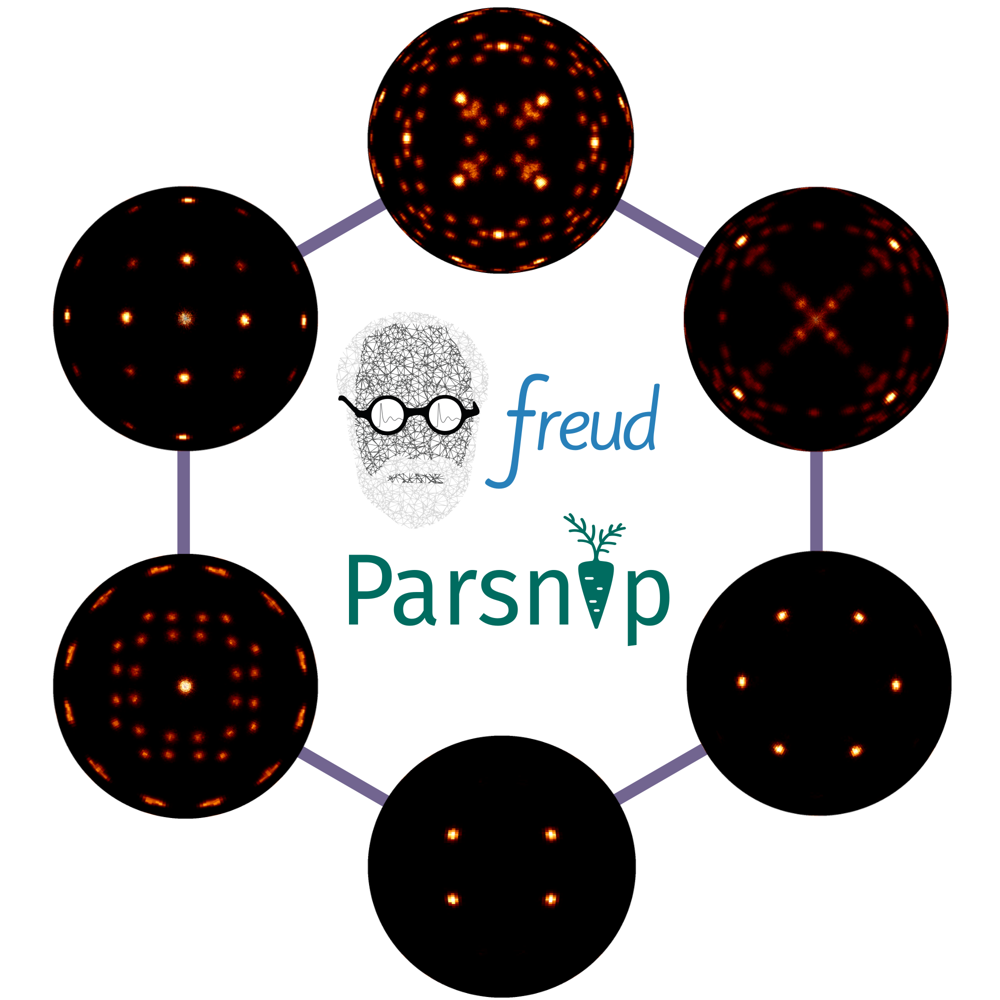
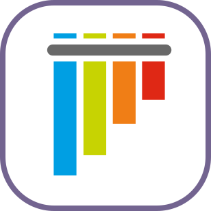

I'm **Jen Bradley**, a PhD researcher in materials science and engineering studying colloidal self-assembly through the lens of molecular simulation. I place a particular focus on the role of particle geometry in assembling and stabilizing complex phases, aiming to design colloidal materials with properties that exceed the capabilities of traditional metals, ceramics, and polymers.

<pre>
 ~> <strong>id -p</strong>
  uid	jenbradley
  groups staff everyone she.her.hers <a href="https://github.com/glotzerlab">glotzerlab</a> <a href="https://engineering.case.edu/research/labs/electro-ceramics/about">CWRU.ECG</a>

 ~> <strong>ls socials</strong>
  <a href="https://www.linkedin.com/in/jenbrad">LinkedIn</a>
  <a href="https://orcid.org/0009-0007-2443-2982">ORCID</a>
</pre>

 <!--- Style for the block above is based on the excellent profile at https://github.com/hedyhli/hedyhl --->

Here are a few visualizations that make use of code I've contributed to or developed!

<!--- TODO: self assembly of some lattice - compress? --->

   
   <!------>
   

## Gists, Experiments, and Small Projects

  
  
  

## Statistics, Languages, and Tools

<!---   --->

  
  

  
  
  
  
  
  
  
  
  
  

<!--- Thanks to [Devicon.dev](https://devicon.dev) for the svg logos that were adapted for this README.md --->

